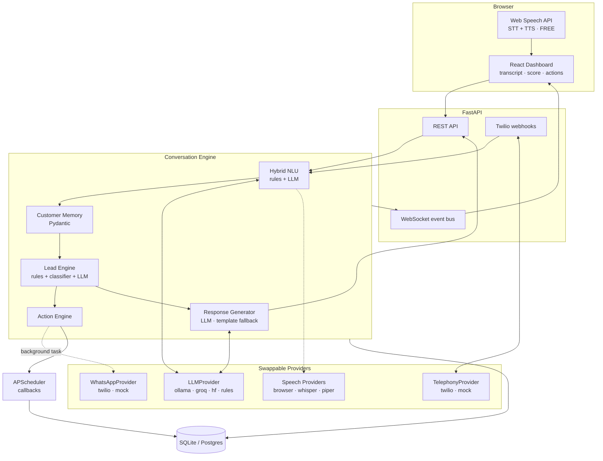

# SwapCircle — AI Voice Sales Agent

An outbound AI voice sales agent for a thrift / clothing-swap store. It calls customers, holds a
natural conversation in **English, Hindi and Hinglish**, understands what they actually want, scores
the lead live, and **takes real actions mid-call** — sending a WhatsApp catalogue or booking a
callback while it is still talking.

**It runs with zero API keys, zero credit card and zero installs beyond Python and Node.**

```bash
# Windows PowerShell, from the project root
cd backend
python -m venv .venv
.\.venv\Scripts\Activate.ps1
pip install -r requirements.txt
python seed_demo_data.py            # optional: realistic demo data
python -m uvicorn app.main:app --reload

# second terminal
cd frontend
npm install
npm run dev                          # http://localhost:5173
```

Then open **http://localhost:5173/demo**, press the microphone, and talk to the agent.

---

## Table of contents

1. [What it does](#1-what-it-does)
2. [Why it costs nothing](#2-why-it-costs-nothing)
3. [Architecture](#3-architecture)
4. [Technology choices](#4-technology-choices)
5. [Running it locally](#5-running-it-locally)
6. [Demo mode](#6-demo-mode)
7. [Real phone calls (Twilio)](#7-real-phone-calls-twilio)
8. [WhatsApp](#8-whatsapp)
9. [How it understands Hinglish](#9-how-it-understands-hinglish)
10. [How lead classification works](#10-how-lead-classification-works)
11. [Training and fine-tuning](#11-training-and-fine-tuning)
12. [Mid-call action engine](#12-mid-call-action-engine)
13. [Callback scheduling](#13-callback-scheduling)
14. [Safety, consent and compliance](#14-safety-consent-and-compliance)
15. [API reference](#15-api-reference)
16. [Docker & deployment](#16-docker--deployment)
17. [Tests](#17-tests)
18. [Limitations](#18-limitations)
19. [What I would build next](#19-what-i-would-build-next)

---

## 1. What it does

| Capability | Detail |
|---|---|
| **Outbound calling** | Twilio for real PSTN calls; a mock provider and a free browser simulator for development |
| **Multilingual conversation** | English, Hindi and Hinglish including mid-sentence code-switching |
| **Structured understanding** | Every utterance becomes a validated Pydantic object: intent, budget, items, brands, size, urgency, location, barriers, sentiment |
| **Live customer memory** | A rolling structured picture of the customer, refined (never overwritten) on every turn |
| **Explainable lead scoring** | 0–100 with a written reason for every point awarded or deducted |
| **Ensemble classification** | Deterministic rules + a trained classifier + an optional LLM, combined with confidence weighting |
| **Mid-call actions** | WhatsApp catalogue and callback booking fire *during* the call, asynchronously |
| **Natural-language scheduling** | "kal shaam 6 baje" → a concrete IST timestamp with a confidence score |
| **Compliance** | Do-not-call detection, opt-out logging, and a hard block on calling opted-out numbers |
| **Live dashboard** | WebSocket-driven transcript, score, extracted data, action feed and WhatsApp simulator |

### The conversation it actually has

```
AGENT    Hi Rahul, this is Ananya from SwapCircle. Is this a good time to talk for a minute?
         We're a thrift and clothing-swap platform in Delhi NCR — you can buy quality
         pre-owned clothes, sell what you don't wear, or swap them. Which sounds useful?
CUSTOMER I need branded jackets and hoodies, my budget is around 1500 and I need them this week.
AGENT    Done — I've just sent our current collection to your WhatsApp. Have a look and tell
         me which ones you like. Shall I keep a couple of these aside for you?
                                        → 70/100 🔥 HOT · WhatsApp dispatched mid-call
CUSTOMER Size L. Can you send me the catalog on WhatsApp?
AGENT    I've already sent it across on WhatsApp — it should be sitting in your chat now.
                                        → 90/100 🔥 HOT
```

And in Hinglish:

```
CUSTOMER Budget around 1000 hai but mujhe branded jackets chahiye, Zara ya H&M type.
         → {budget: 1000 INR "around", categories: ["jacket"], brands: ["zara","h&m"],
            language: "hinglish", intent: "buy_thrift_clothes"}
AGENT    Sahi hai. Aur kab tak chahiye - is hafte ya abhi plan kar rahe ho?
```

---

## 2. Why it costs nothing

Every component is labelled and swappable. The **default configuration is entirely in the FREE
column** — the app boots and runs a full call with no `.env` file at all.

| Component | Default (FREE) | Upgrade (FREE TIER) | Paid |
|---|---|---|---|
| **Speech-to-text** | Browser Web Speech API — on-device, no bill | `faster-whisper` locally | — |
| **Text-to-speech** | Browser `speechSynthesis` | Piper (local neural TTS) | — |
| **Language model** | **Rule-based NLU + template NLG** (no model at all) | Ollama locally, or Groq / HF Inference free tier | OpenAI-compatible |
| **Lead classifier** | scikit-learn TF-IDF, ~300 KB, CPU | Sentence-transformers, MuRIL fine-tune | — |
| **Database** | SQLite file | Postgres (Neon / Supabase free tier) | Managed Postgres |
| **Telephony** | Mock provider + browser demo | — | **Twilio, per minute** |
| **WhatsApp** | Mock + in-dashboard simulator | Twilio WhatsApp **sandbox** (free) | WhatsApp Business API |
| **Scheduler** | APScheduler in-process | — | Celery + Redis |
| **Hosting** | Local | Render / Fly / HF Spaces free tiers | — |

**The only thing that ever costs money is real phone minutes.** Everything else — the whole AI
pipeline, scoring, actions, dashboard — runs free forever.

### The design decision that makes this work

Most voice-agent projects are unusable without an API key. This one treats the LLM as an
**optional enhancement, not a dependency**:

- `RuleBasedProvider` reports `available = False`, and the conversation engine falls back to a
  deterministic NLU (regex + keyword banks tuned for Indian English/Hindi/Hinglish) and a
  template response generator with multiple phrasings per slot in three languages.
- When an LLM *is* configured, it layers on top — but the regex layer stays authoritative for
  money, opt-outs and callback requests, because a 3B model must never mis-hear "don't call me
  again".

So the demo always works, and adding `OPENAI_API_KEY=gsk_...` upgrades the prose without changing
a single line of business logic.

---

## 3. Architecture



### The per-turn pipeline

```
customer utterance
   ↓
persist message
   ↓
NLU            rules extractor (always) ⊕ LLM extractor (if available)
   ↓           → rules win on money, opt-outs, callbacks
merge memory   additive: later turns refine, never blank out
   ↓
score          rules engine ⊕ trained classifier ⊕ LLM judge → weighted vote
   ↓
decide actions pure function, no I/O — trivially testable
   ↓
dispatch       callbacks resolve inline; WhatsApp fires as a background task
   ↓
generate reply LLM with memory + RAG context, template responder as fallback
   ↓
broadcast      WebSocket → dashboard updates live
```

Full detail in [`docs/architecture.md`](docs/architecture.md).

### Project layout

```
swap-ai-agent/
├── backend/
│   ├── app/
│   │   ├── main.py                     FastAPI app + lifespan
│   │   ├── core/                       config, logging, event bus, store profile
│   │   ├── db/                         SQLAlchemy session
│   │   ├── models/                     12 tables
│   │   ├── schemas/                     Pydantic: NLU contracts + API contracts
│   │   ├── api/routes/                 calls, leads, whatsapp, callbacks,
│   │   │                               dashboard, config, training, telephony, ws
│   │   └── services/
│   │       ├── conversation/           engine, rules_nlu, extractor, responder,
│   │       │                           prompts, knowledge (RAG)
│   │       ├── classification/         scoring, ml_classifier, ensemble, dataset, trainer
│   │       ├── actions/                mid-call action engine
│   │       ├── llm/                    provider abstraction + factory
│   │       ├── telephony/              twilio + mock
│   │       ├── whatsapp/               providers + message composer
│   │       ├── speech/                 browser / whisper / piper
│   │       └── scheduling/             APScheduler + natural-language time parser
│   ├── tests/                          49 tests
│   └── seed_demo_data.py               replays scripted calls through the real engine
├── frontend/                           React + Vite (5 deps, no CSS framework)
├── training/                           dataset generator, trainer, evaluation
├── docs/
├── docker-compose.yml
└── .env.example
```

---

## 4. Technology choices

| Choice | Why |
|---|---|
| **FastAPI** | Async-native (essential for fire-and-forget actions), Pydantic validation, free OpenAPI docs |
| **Pydantic v2 everywhere** | The LLM is asked for a schema and the rule engine *builds* that same schema, so downstream code has one shape to reason about — and invalid LLM JSON is repaired, then re-prompted |
| **SQLAlchemy 2.0 typed models** | Identical code on SQLite and Postgres |
| **APScheduler over Celery** | Callbacks are low-volume and in-process; no Redis, no worker, no extra container. Swapping to Celery later means changing one module |
| **Twilio `<Gather input="speech">` over Media Streams** | Twilio does the STT, so there is no audio WebSocket to host and it works from a laptop behind ngrok. One HTTP round-trip per conversational turn |
| **React + Vite, 5 dependencies** | No Tailwind, no component library, no chart library — a hand-written CSS design system and SVG gauges. Nothing to break, nothing to audit |
| **Web Speech API** | The single biggest cost decision: browser-native STT/TTS with `en-IN` and `hi-IN` support makes voice demos free |
| **TF-IDF word + char n-grams** | Char n-grams absorb Hinglish spelling chaos (*nahi/nahin/nai*) without any model download. 300 KB, sub-millisecond CPU inference |

---

## 5. Running it locally

### Prerequisites
Python 3.10+ and Node 18+. Nothing else.

### Windows (PowerShell) — exact commands

```powershell
cd backend
python -m venv .venv
.\.venv\Scripts\Activate.ps1
pip install -r requirements.txt

copy ..\.env.example ..\.env      # optional — it runs fine without one

python ..\training\generate_dataset.py --samples 180   # optional
python ..\training\train_classifier.py                 # optional
python seed_demo_data.py --reset                       # optional demo data

python -m uvicorn app.main:app --reload --port 8000
```

```powershell
# second terminal
cd frontend
npm install
npm run dev
```

| URL | What |
|---|---|
| http://localhost:5173 | Dashboard |
| http://localhost:5173/demo | **Live call screen — start here** |
| http://localhost:8000/docs | Interactive API docs |
| http://localhost:8000/api/dashboard/health | Which providers are active |

If PowerShell blocks the activate script:
`Set-ExecutionPolicy -Scope Process -ExecutionPolicy Bypass`

### macOS / Linux

```bash
cd backend && python3 -m venv .venv && source .venv/bin/activate
pip install -r requirements.txt && python -m uvicorn app.main:app --reload
cd ../frontend && npm install && npm run dev
```

### Optional: a real local LLM (still free)

```bash
# install Ollama from ollama.com, then
ollama pull qwen2.5:3b-instruct
```

Set `LLM_PROVIDER=auto` (the default) and restart — it is detected automatically. Or switch
providers live from the **Settings** page without restarting.

---

## 6. Demo mode

The reason this project is demonstrable without spending anything.

Open **/demo** and you get:

- **Talk with your microphone** — the Web Speech API transcribes `en-IN` / `hi-IN` on-device,
  the agent replies, and `speechSynthesis` speaks it back in an Indian voice.
- **Or type** — same pipeline, useful in Firefox (no `SpeechRecognition`) or a quiet room.
- **7 prebuilt scenarios** — HOT, WARM, COLD, Hinglish budget extraction, a seller, an
  objection-handling run, and a do-not-call compliance run. Hit **Auto-play** to watch the whole
  call drive itself.
- **Live intelligence panel** — the score gauge, the reason list, extracted fields and the action
  feed all update per turn.
- **WhatsApp simulator** — a WhatsApp-styled phone panel where the mid-call message appears about
  400 ms after it is triggered, because the send genuinely runs in a background task.

The pipeline is byte-identical to a real phone call. Only the transport differs.

---

## 7. Real phone calls (Twilio)

**This is the only part that costs money.** A Twilio trial gives enough credit to test.

1. Create a Twilio account, buy a number with Voice capability.
2. Expose your local backend: `ngrok http 8000`
3. In `.env`:

```env
TELEPHONY_PROVIDER=twilio
TWILIO_ACCOUNT_SID=ACxxxxxxxx
TWILIO_AUTH_TOKEN=xxxxxxxx
TWILIO_PHONE_NUMBER=+1xxxxxxxxxx
PUBLIC_BASE_URL=https://your-ngrok-id.ngrok-free.app
```

4. Restart, open `/demo`, tick **Place a real phone call**, enter a number in E.164 format.

On a Twilio trial you can only dial numbers you have verified in the console.

**How the call flows**

```
POST /api/calls/start
   → Twilio dials the customer, webhook → POST /api/telephony/twilio/voice
   → agent's opening line is spoken via <Say>, <Gather input="speech"> listens
   → Twilio posts SpeechResult back to the same webhook
   → engine.handle_turn() → reply returned as TwiML <Say> + a fresh <Gather>
   → repeat until the engine decides to close, then <Hangup>
   → StatusCallback finalises duration, transcript and summary
```

Voicemail is detected (`MachineDetection`) and the call is dropped without leaving a message or
polluting the lead. Silence gets one polite nudge, then a graceful close.

---

## 8. WhatsApp

Three interchangeable implementations behind one interface:

| Provider | Cost | Use |
|---|---|---|
| `mock` (default) | FREE | Renders in the dashboard's WhatsApp simulator |
| `twilio` sandbox | FREE | Real WhatsApp delivery; recipient joins the sandbox first |
| Twilio WhatsApp | Paid | Production |

```env
WHATSAPP_PROVIDER=twilio
TWILIO_WHATSAPP_FROM=whatsapp:+14155238886
```

### Messages are composed from what the customer actually said

A generic template is only allowed when we genuinely learned nothing. Every known fact appears,
in the customer's own language:

> **HOT (English)**
> Hey Rahul! Great speaking with you just now — thanks for your time.
> Based on what you said, you're looking for jackets, hoodies around Rs.1500 this week (size L).
> I've put our current collection here: …
> Tell me which pieces you like and I'll hold them for you.

> **WARM (Hinglish, with the captured blocker and the agreed callback)**
> Hi Priya! Abhi baat karke achha laga!
> Aapne bola tha ki aapko kurtas Rs.800 ke aas-paas chahiye.
> Ye poora current collection hai, dekh lijiye.
> Jaisa baat hui, main Mon 24 Aug at 6:00 PM call karungi.

> **COLD** — a short, respectful message with no pressure and no follow-up scheduled.

---

## 9. How it understands Hinglish

Three layers, each doing what it is best at.

**1. Language detection** (`utils/text.py`) — Devanagari wins outright; otherwise the ratio of
romanised-Hindi markers to sentence length decides between `english`, `hinglish` and `hindi`.
The agent then replies in the customer's language and does not switch unprompted.

**2. Deterministic extraction** (`conversation/rules_nlu.py`) — keyword banks and regexes built
for Indian phone conversations:

- **Money**: `under 500`, `around 1k`, `₹1,200`, `2 hazar tak`, `1000 ke andar`, `बजट 800` — with
  context guards so `size 32`, `call me at 6` and `6 baje` are never read as budgets.
- **Intent**: buy / sell / swap / donate / catalogue / visit / callback / browsing / not-interested
  / do-not-call, in all three languages.
- **Barriers**: budget, trust, hygiene, needs-permission, no-time, wants-to-see-inventory, returns.
- **Urgency**: `today / aaj / abhi`, `is hafte`, `agle mahine`…

**3. LLM extraction** (when configured) — a few-shot prompt returning the same Pydantic schema,
merged *under* the regex layer:

```python
if rules.budget.amount:      out.budget = rules.budget       # regex wins on money
if rules.do_not_call:        out.do_not_call = True          # regex wins on compliance
out.product_categories = union(rules.categories, llm.categories)   # additive elsewhere
out.buying_intent = (rules.buying_intent + llm.buying_intent) / 2  # blended confidence
```

Real bugs this layering caught during development, now covered by tests:

- `"Send me the catalog on WhatsApp"` was read as a *question*, because substring matching found
  `"what"` inside `"WhatsApp"`. Question markers now match on word boundaries.
- `"Please don't call me again"` was booking a **callback**, because `"call me"` is a substring of
  `"don't call me again"`. Opt-out now suppresses callback and catalogue intents outright.
- `"budget around 1000"` parsed as **100**, because the comma-group regex branch matched first.

---

## 10. How lead classification works

### Layer 1 — deterministic scoring (always on, fully auditable)

Configurable weights, live-editable from the Settings page:

| Signal | Points | | Signal | Points |
|---|---|---|---|---|
| Clear buying intent | +25 | | Wants to sell or swap | +22 |
| Requests catalogue | +20 | | Requests store visit | +20 |
| Specific budget | +15 | | Specific product | +15 |
| Urgent timeline | +15 | | Agrees to callback | +10 |
| Asked product questions | +8 | | Positive sentiment | +5 |
| Budget objection | −5 | | Needs to ask someone | −5 |
| Trust/hygiene concern | −3 | | Just browsing | −20 |
| No interest | −40 | | Do-not-call | −60 |

Thresholds: **HOT ≥ 60**, **WARM ≥ 20**, otherwise COLD. An early low-signal conversation stays
`UNKNOWN` rather than being written off as COLD.

Every score ships with its reasoning:

```json
{
  "score": 70,
  "classification": "HOT",
  "reasons": [
    "Customer showed clear buying intent (+25)",
    "Customer mentioned a Rs.1500 budget (+15)",
    "Customer asked for jacket, hoodie (+15)",
    "Customer needs it this week (+15)"
  ]
}
```

### Layer 2 — trained classifier

TF-IDF (word 1–2 grams + character 2–5 grams) → logistic regression, on 540 synthetic
English/Hindi/Hinglish utterances.

### Layer 3 — LLM judge (optional)

Reads the last 10 turns and returns `{label, confidence, reason}`. The reason is surfaced in the
dashboard.

### The ensemble

```
vote(label) += weight(voter) × confidence(voter)
   rules 0.5 · classifier 0.3 · llm 0.2
```

Two rules make it trustworthy rather than just clever:

1. **Ties go to the rules engine** — it is the auditable voter.
2. **HOT must be earned deterministically.** A confident model guess cannot alone produce HOT,
   because HOT triggers a real customer-facing WhatsApp send. If the rules haven't found business
   signals, the ensemble caps at WARM.

That second rule came out of testing: the classifier confidently labelled *"How do I know the
clothes are clean?"* as HOT, and without the guard the agent would have fired a catalogue at a
customer who had only asked a hygiene question.

Compliance beats every voter: opt-out or explicit disinterest is COLD, always.

---

## 11. Training and fine-tuning

**Fine-tuning an LLM here would be the wrong call**, and the project says so explicitly. The
conversation is handled by prompting + RAG + rules, because the store profile changes weekly and a
prompt edit ships instantly while a fine-tune does not. What *is* trained is the narrow, high-volume
task: **lead classification**.

```bash
python training/generate_dataset.py --samples 180   # 540 rows
python training/train_classifier.py                 # trains + evaluates
python training/evaluate.py                         # rules vs classifier comparison
```

Or drive it from the **AI & Training** page in the dashboard.

### Honest evaluation

The first training run reported **100% accuracy** — which was a red flag, not a result. A random
row split leaked near-duplicate sentences from the same template into the test set. The trainer now
uses `GroupShuffleSplit` keyed on template id, so **the test set contains phrasings the model has
never seen**:

```
Model:            tfidf_logreg
Training rows:    540
Holdout accuracy: 0.921      ← unseen phrasings
5-fold CV:        0.987 ± 0.014

label   precision   recall       f1  support
HOT         0.897    0.867    0.881       30
WARM        0.929    1.000    0.963       26
COLD        0.932    0.911    0.921       45

Confusion matrix (rows = true, cols = predicted)
             HOT   WARM   COLD
    HOT       26      1      3
   WARM        0     26      0
   COLD        3      1     41
```

92.1% on unseen phrasings is the number worth quoting. The 98.7% CV figure is inflated by template
overlap and is reported only for contrast.

### Where the three methods disagree

```
truth=WARM rules=UNKNOWN clf=WARM (0.93)  Haan मुझे पहले घर में पूछना पड़ेगा, फिर बताती हूँ।
truth=HOT  rules=WARM    clf=HOT  (0.95)  Budget around 1000 hai but mujhe branded sweater chahiye.
truth=WARM rules=COLD    clf=WARM (0.96)  1000 thoda zyada hai, kuch sasta ho to batao.
```

This is the point of the ensemble, and the division of labour is deliberate:

```
LLM        → understands meaning and context across the whole call
Classifier → fast per-utterance intent, robust to Hinglish spelling
Rules      → deterministic business decisions you can defend to a sales manager
```

The rules engine scores a **whole conversation** and deliberately abstains (`UNKNOWN`) on a single
ambiguous line; the classifier scores **individual utterances**. Neither is strictly better — which
is exactly why both vote.

### Dataset

540 rows, roughly 53% English / 34% Hinglish / 13% Hindi, covering code-switching, indirect intent,
budget objections, vague answers and opt-outs, with light augmentation (fillers, tails, casing) so
the model can't memorise template prefixes.

**Upgrade path**: swap `TfidfVectorizer` for sentence-transformer embeddings, or fine-tune
MuRIL/IndicBERT (both strong on Hinglish). The `LeadClassifier` interface stays identical — only
`trainer.py` changes.

---

## 12. Mid-call action engine

The rule that matters: **decide synchronously, execute asynchronously.**

```
Customer: "Send me the catalog on WhatsApp."
   ↓ intent detected
   ↓ Action row persisted (status=queued) → broadcast to dashboard immediately
   ↓ asyncio.create_task(send)          ← conversation does NOT wait
Agent:    "Done — I've just sent our current collection to your WhatsApp."
   ↓ ~400 ms later: message lands, status → sent, dashboard updates
```

A slow WhatsApp API can never stall the conversation. The decision function is pure:

```python
def decide(turn, memory, classification, already_done) -> list[dict]:
    ...   # no I/O, no DB — unit-tested in isolation
```

Actions: `send_whatsapp`, `schedule_callback`, `mark_do_not_call`, `end_call`. Each is
deduplicated per call (the agent says *"I've already sent it across"* instead of sending twice),
persisted with its trigger reason, and streamed to the dashboard.

---

## 13. Callback scheduling

`services/scheduling/nlp_time.py` turns speech into a timestamp, and reports how confident it is:

| Customer said | Scheduled (IST) | Confidence | Interpretation |
|---|---|---|---|
| "call me tomorrow morning" | Tomorrow 10:00 | 0.90 | tomorrow, morning defaulted to 10:00 |
| "kal shaam 6 baje" | Tomorrow 18:00 | 0.90 | tomorrow, 18:00 |
| "after 6" | Today 19:00 | 0.80 | after 6, scheduled at 19:00 |
| "next Monday" | Monday 11:00 | 0.60 | Monday, no time given, defaulted to 11 AM |
| "call me sometime" | Tomorrow 11:00 | 0.35 | could not read a specific time |

Guards: nothing is ever scheduled in the past, and everything is clamped into 09:00–21:00 calling
hours (`Asia/Kolkata`), with the adjustment recorded in the interpretation string and reflected in
the confidence. All timestamps are stored UTC and displayed IST.

APScheduler fires the callback, broadcasts `callback.due` to the dashboard, and a 5-minute sweeper
plus job rehydration on boot means callbacks survive a restart.

Try it live on the **Callbacks** page, or `POST /api/callbacks/parse`.

---

## 14. Safety, consent and compliance

- The agent **identifies itself and the store in its first sentence**, every call.
- **Opt-out is detected in all three languages** — *"don't call me again"*, *"remove my number"*,
  *"call mat kijiye"*, *"फोन मत कीजिए"*.
- On opt-out the agent apologises, confirms removal and hangs up; the customer is flagged, added to
  the `do_not_call_list`, and **any pending callbacks are cancelled**.
- `POST /api/calls/start` returns **403** for an opted-out number — the block is enforced at the
  API boundary, not just in the UI.
- Cold leads are closed respectfully with no aggressive follow-up.
- No credentials are ever exposed to the browser; the Settings page can switch providers but never
  read or write secrets.

---

## 15. API reference

Interactive docs at `/docs`. All routes are under `/api`.

### Calls
| Method | Path | Purpose |
|---|---|---|
| POST | `/calls/start` | Start a real outbound call (403 if opted out) |
| POST | `/calls/demo/start` | Start a free browser demo call |
| GET | `/calls/demo/scenarios` | The 7 prebuilt scenarios |
| POST | `/calls/{id}/turn` | Submit one customer utterance → full turn result |
| POST | `/calls/{id}/end` | End call, write transcript, generate summary |
| GET | `/calls`, `/calls/{id}`, `/calls/{id}/transcript` | History |

### Leads
| Method | Path | Purpose |
|---|---|---|
| GET | `/leads?status=HOT&search=…&min_score=…` | Filtered list |
| GET | `/leads/{id}` | Transcript, score history, actions, WhatsApp, callbacks |
| PATCH | `/leads/{id}` | Manual override, including do-not-call |
| GET | `/leads/{id}/score-explanation` | Full audit trail of the score |

### Actions, scheduling, config, training
| Method | Path | Purpose |
|---|---|---|
| POST | `/whatsapp/send` · `/whatsapp/preview` | Send / preview a personalised message |
| GET | `/whatsapp/messages` | History |
| POST | `/callbacks` · `/callbacks/parse` | Schedule from natural language; parse only |
| GET/PATCH | `/callbacks` · `/callbacks/{id}` | List, complete, cancel |
| GET | `/dashboard/stats` · `/recent-activity` · `/funnel` · `/health` | Aggregates |
| GET/PATCH | `/config/store` | Store profile, scoring weights, thresholds, FAQ |
| GET/POST | `/config/providers` | Inspect and hot-swap providers |
| POST | `/training/generate-dataset` · `/train` · `/classify` · `/benchmark` | ML workflow |
| GET | `/training/results` · `/dataset` | Metrics and rows |
| WS | `/ws` | Live events |

### WebSocket events

`call.started` · `message.agent` · `message.customer` · `lead.updated` · `action.queued` ·
`action.completed` · `whatsapp.sent` · `callback.due` · `call.ended` · `call.status` ·
`telephony.speech`

```json
{ "type": "lead.updated", "call_id": 7, "ts": "…",
  "data": { "score": 70, "classification": "HOT", "reasons": [...], "memory": {...} } }
```

`GET /api/events/recent` is an HTTP fallback for proxies that block WebSockets.

---

## 16. Docker & deployment

```bash
cp .env.example .env
docker compose up --build
# dashboard http://localhost:3000 · api http://localhost:8000
```

The default stack is SQLite + rule-based AI + mock providers — still free in a container. The
compose file has commented-out services for **PostgreSQL** and **Ollama**; uncomment either without
touching application code.

**Free hosting that fits this app**: backend on Render or Fly.io free tier (or a Hugging Face
Space), Postgres on Neon or Supabase free tier, frontend on Vercel/Netlify (set `VITE_API_BASE` to
the backend URL). For real calls, point `PUBLIC_BASE_URL` at the deployed backend so Twilio can
reach the webhooks.

---

## 17. Tests

```bash
cd backend
.\.venv\Scripts\python.exe -m pytest        # 49 tests
```

Covering Hinglish money parsing, language detection, intent extraction, memory merging, scoring and
threshold behaviour, configurable weights, natural-language time parsing (including the
calling-hours clamp), the pure action-decision function, and end-to-end API flows — HOT call with a
mid-call WhatsApp, callback scheduling, and the opt-out 403.

The regressions listed in [§9](#9-how-it-understands-hinglish) each have a dedicated test.

---

## 18. Limitations

Stated plainly, because these are the questions an interviewer should ask.

1. **The training data is synthetic.** 540 template-generated rows are enough to bootstrap a
   classifier, not to prove production accuracy. Real call transcripts would replace it; the
   grouped split keeps the reported number honest in the meantime.
2. **Turn-based, not full-duplex.** With Twilio `<Gather>` the customer cannot interrupt
   mid-sentence — real barge-in needs Media Streams with a streaming STT and VAD.
3. **Latency depends on the LLM.** Rule-based mode replies in ~20 ms. Ollama on a laptop adds
   1–3 s, which is noticeable on a phone call; Groq's free tier is the practical middle ground.
4. **Hinglish detection is heuristic**, not a trained language ID model. It handles common
   conversational Hindi well and will misjudge unusual transliterations.
5. **The FAQ retriever is bag-of-words**, not embeddings — fine for ~10 entries, would need a real
   vector store past a few dozen.
6. **In-process scheduler**, so callbacks live in one process's memory. Jobs are rehydrated from the
   database on boot and swept every 5 minutes, but multi-instance deployment needs Celery or a
   database-backed job store.
7. **Web Speech API is Chrome/Edge only.** Firefox and Safari fall back to the text input.
8. **Single-tenant.** One store profile, no auth. Both are deliberate scope cuts, not oversights.

---

## 19. What I would build next

1. **Twilio Media Streams + faster-whisper + Piper** for true barge-in and sub-second replies.
2. **Fine-tune MuRIL** on real labelled transcripts once there are a few thousand.
3. **A/B test opening lines** per campaign and score them on conversion, not on vibes.
4. **Celery + Redis** for the action queue, so actions survive a crash and scale horizontally.
5. **Real CRM sync** (HubSpot/Zoho) with the lead score and reasons attached.
6. **Auth and multi-tenancy** so several stores can run their own agents and profiles.
7. **Post-call analytics**: which objections kill deals, which questions predict conversion, and
   which agent phrasings actually work.

---

## Screenshots

> Placeholders — capture from a running instance.

| | |
|---|---|
| `docs/screenshots/dashboard.png` | Dashboard: stats, funnel, hot leads, activity |
| `docs/screenshots/live-call.png` | Live call: transcript, score gauge, actions, WhatsApp simulator |
| `docs/screenshots/lead-detail.png` | Lead detail: transcript, ensemble breakdown, score history |
| `docs/screenshots/training.png` | Training: metrics, confusion matrix, three-way classifier comparison |

---

Built as a demonstration of production-shaped engineering: provider abstractions, graceful
degradation, explainable ML, honest evaluation, and a system that stays useful when every optional
dependency is missing.
