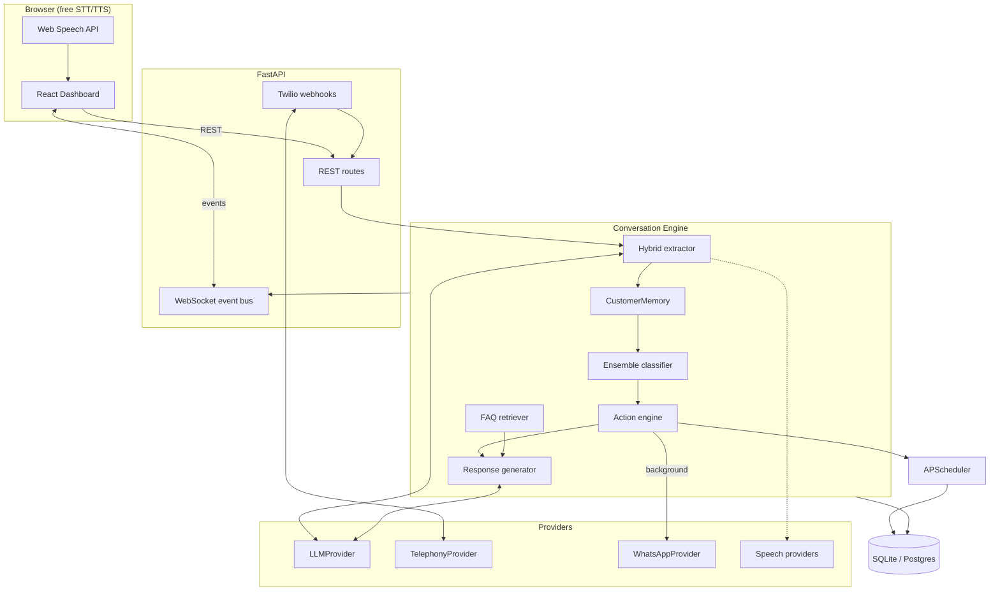
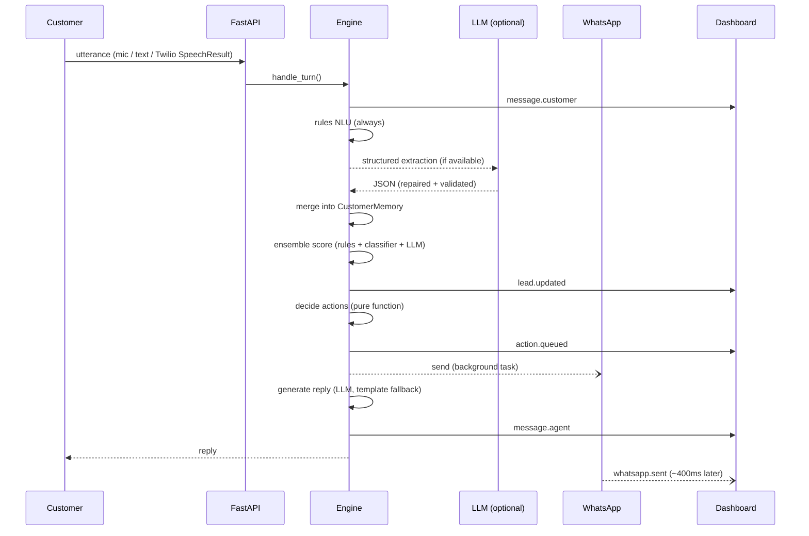
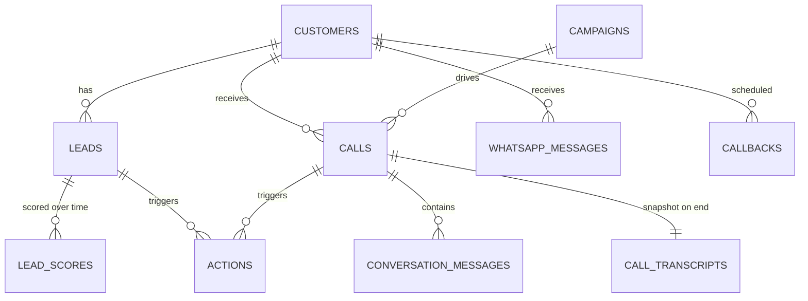

# Architecture

## 1. System view



## 2. One conversational turn



The customer never waits on WhatsApp: the reply is produced and returned while the send is still
in flight.

## 3. Graceful degradation

Each row is what happens when the dependency above it is missing.

| Missing | Behaviour |
|---|---|
| LLM | `RuleBasedProvider.available = False` → deterministic NLU + template NLG in 3 languages |
| Trained classifier | Ensemble drops that voter; rules + LLM still decide |
| Twilio | `MockTelephonyProvider`; the browser demo becomes the "line" |
| WhatsApp credentials | `MockWhatsAppProvider`; messages render in the dashboard simulator |
| Postgres | SQLite file, same SQLAlchemy models |
| Redis / Celery | APScheduler in-process |
| Web Speech API | Text input; the pipeline is unchanged |

Nothing in this table breaks the call. That is the core design constraint.

## 4. Provider abstractions

```python
class LLMProvider(ABC):
    available: bool
    async def chat(messages, temperature, max_tokens, json_mode) -> str
    async def complete_json(messages) -> dict | None   # repair, then retry

class TelephonyProvider(ABC):
    async def make_call(customer_name, phone_number, campaign_type, call_id) -> dict
    async def end_call(call_sid) -> dict

class WhatsAppProvider(ABC):
    async def send_message(to_number, body) -> dict
    async def send_media(to_number, media_url, caption) -> dict

class SpeechToTextProvider(ABC):
    async def transcribe(audio_bytes, language) -> dict

class TextToSpeechProvider(ABC):
    async def synthesize(text, language) -> dict
```

Each has a factory reading config, a module-level singleton, and a setter used by
`POST /api/config/providers` for hot-swapping and by tests for injection.

## 5. Data model



Plus `do_not_call_list` (compliance) and `store_configuration` (single row: profile, scoring
weights, thresholds, FAQ).

Design notes:

- `leads.memory` holds the whole `CustomerMemory` object as JSON — a schema-flexible document
  inside a relational row, so adding a new extracted field needs no migration.
- `lead_scores` stores **every** scoring decision with each voter's label and the ensemble detail,
  which is what makes the dashboard's "why is this HOT?" panel possible after the fact.
- `actions` records the trigger reason, not just the action, so a sales manager can audit why the
  agent messaged a customer.
- All timestamps are UTC in the database and IST in the UI (`utils/timeutil.py`).

## 6. Where each concern lives

| Concern | Module |
|---|---|
| Deterministic NLU | `services/conversation/rules_nlu.py` |
| Hybrid extraction + merge policy | `services/conversation/extractor.py` |
| Template NLG (3 languages) | `services/conversation/responder.py` |
| Prompts + few-shots | `services/conversation/prompts.py` |
| FAQ retrieval (RAG) | `services/conversation/knowledge.py` |
| Orchestration | `services/conversation/engine.py` |
| Business scoring rules | `services/classification/scoring.py` |
| Trained model | `services/classification/{trainer,ml_classifier}.py` |
| Voting | `services/classification/ensemble.py` |
| Mid-call actions | `services/actions/engine.py` |
| Time understanding | `services/scheduling/nlp_time.py` |
| Message composition | `services/whatsapp/composer.py` |

## 7. Invariants worth keeping

1. **Regex beats the model on money, opt-outs and callbacks.** A hallucinated budget corrupts a
   lead; a missed opt-out is a compliance failure.
2. **HOT must be earned deterministically** — it triggers a customer-facing message.
3. **Actions decide synchronously, execute asynchronously.** The conversation never blocks on I/O.
4. **Memory merges additively.** A later turn refines what we know; it never blanks it out.
5. **Every score carries its reasons.** An unexplainable score is not usable by a sales team.
